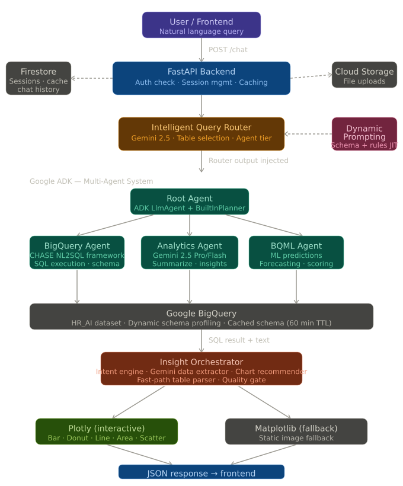

# ⚡ HR_Agent - Conversational Business Intelligence Platform

> **Ask questions in plain English. Get SQL-powered answers, interactive charts, and AI-generated insights - instantly.**

HR_Agent is a full-stack, production-grade AI analytics platform that lets enterprise users query BigQuery data warehouses through natural language. It combines **Google Gemini 2.5 Pro**, a **multi-agent ADK architecture**, dynamic prompt engineering, and an auto-visualization engine into a single conversational interface.

Originally built for enterprise HR analytics, the architecture is fully modular and adapts to any BigQuery-connected domain (Finance, Supply Chain, Operations, etc.).

---

### 🎬 Full Demo Video

https://github.com/user-attachments/assets/811a98a8-1c3f-47b3-8a5a-615456065dd1


<!-- ## 🎬 Demo -->

<!-- ============================================================
SCREENSHOT GUIDE - What to capture:
  1. HERO SHOT: Full chat UI with a sample question visible
     e.g. "What is the attrition rate by division?"
     → Capture the response WITH the Plotly chart rendered below it
     Resolution: 1440×900 or higher, light mode preferred

  2. ROUTING DECISION: Open browser DevTools → Network tab,
     send a query, and screenshot the /chat response JSON
     showing "chosen_tables", "NL2SQL_Model", "BQA_Agent" fields

  3. MULTI-AGENT FLOW: Screenshot the backend terminal logs
     showing the orchestrator route: Router → BQ Agent → Analytics Agent

  4. CHART TYPES: Capture 3-4 different chart outputs side by side
     (bar, donut, line, horizontal bar)

  5. AUTH FLOW: Screenshot the Google OAuth login page branded
     with your app name, then the successful redirect

SCREEN RECORDING GUIDE:
  - Use OBS Studio (free) or Quicktime (Mac) for recording
  - Resolution: 1920×1080, 30fps
  - Record a 90-second walkthrough:
      00:00 – Landing / Login screen
      00:10 – Type a question ("Show me headcount by department")
      00:25 – Watch streaming response + chart appear
      00:45 – Ask a follow-up ("Which division has highest attrition?")
      01:05 – Show chart type changes dynamically
      01:20 – Wrap up on dashboard
  - Export as MP4 and upload to YouTube (unlisted) or embed as GIF
    (use ezgif.com to convert a short clip to GIF, max 10MB)
============================================================ -->

<!-- | Chat + Chart | Multi-Agent Routing | Auth Flow |
|---|---|---|
|  |  |  | -->

<!-- > 📹 **Full walkthrough**: [Watch on YouTube](https://youtube.com/your-demo-link) *(replace with your link)* -->

---

## ✨ Key Features

- **🗣️ Natural Language → SQL** - Type any business question; Gemini translates it to optimized BigQuery SQL using the CHASE framework
- **🤖 Multi-Agent Architecture** - Google ADK orchestrates specialized sub-agents: a BigQuery Agent, a BQML Analytics Agent, and an Analytics summarizer
- **📊 Auto-Visualization** - Gemini extracts chart-ready data from responses and renders interactive Plotly charts (bar, donut, line, area, scatter, horizontal bar)
- **⚡ Smart Query Routing** - An LLM-powered router picks the right tables, SQL strategy, and agent tier (Flash vs Pro) based on query complexity
- **🧠 Dynamic Prompt Engineering** - Schema is cached from BigQuery, profiled live, and injected into JIT prompts with domain-specific business rules (HR, Finance, SCM)
- **🔐 Enterprise Auth** - Google OAuth 2.0 + Mahindra SSO JWT; session management via Firestore
- **📁 File Upload & Analysis** - Upload CSVs/Excel; the platform runs ad-hoc analysis via GCS
- **🚀 Cloud-Native Deployment** - Dockerized FastAPI app designed for Google Cloud Run with Gunicorn + Uvicorn workers

---

## 🏗️ Architecture

<!-- ============================================================
ARCHITECTURE DIAGRAM:
  The diagram below is rendered from the architecture.svg file.
  To display it properly on GitHub, the SVG file must be
  committed to assets/architecture.svg in this repository.

  If you want to regenerate or edit the diagram, open
  assets/architecture.svg in any vector editor (Figma, Inkscape,
  or VS Code with SVG Preview extension).
============================================================ -->



### Request Flow

```
User Question
     │
     ▼
┌─────────────────┐
│  FastAPI /chat  │  ← Auth check (session cookie / JWT)
└────────┬────────┘
         │
         ▼
┌─────────────────┐
│  Query Router   │  ← Gemini reads hr_tables_metadata.json
│  (Gemini 2.5)  │    Selects tables + SQL strategy + agent tier
└────────┬────────┘
         │
    ┌────┴────┐
    │         │
    ▼         ▼
┌───────┐ ┌──────────┐
│  BQ   │ │ Analytics│   Google ADK Runner
│ Agent │ │  Agent   │   (VertexAI Session Service)
└───┬───┘ └────┬─────┘
    │           │
    ▼           ▼
┌───────────────────┐
│    BigQuery       │  ← SQL executed, results returned
│  (HR_AI dataset)  │
└───────────────────┘
         │
         ▼
┌─────────────────────┐
│  Insight Orchestr.  │  ← Checks if response is chartable
│  + Gemini Extractor │    Extracts {label, value} pairs
└────────┬────────────┘
         │
    ┌────┴────┐
    │         │
    ▼         ▼
 Plotly    Matplotlib
 (interactive) (fallback)
         │
         ▼
┌─────────────────┐
│   JSON Response │  plotly_html + text + suggestions
│   to Frontend   │
└─────────────────┘
```

---

## 📁 Project Structure

```
nexus-iq/
├── main.py                          # FastAPI app factory & lifespan hooks
├── Dockerfile                       # Cloud Run deployment config
├── requirements.txt                 # All Python dependencies
├── dataset_config.json              # BigQuery dataset declarations
├── hr_tables_metadata.json          # Table/column metadata for routing
│
├── app/                             # Core application layer
│   ├── startup.py                   # Singleton bootstrap (ADK, Firestore, Gemini)
│   ├── core/
│   │   ├── config.py                # Environment variable loading
│   │   ├── logging.py               # Structured logging setup
│   │   └── middleware.py            # CORS + session middleware
│   ├── auth/
│   │   └── utils.py                 # JWT validation, session helpers
│   ├── db/
│   │   └── firestore.py             # Chat history, response cache, session store
│   ├── routers/
│   │   ├── auth.py                  # Google OAuth 2.0 + SSO JWT endpoints
│   │   ├── chat.py                  # POST /chat - main inference endpoint
│   │   ├── files.py                 # File upload → GCS
│   │   ├── sessions.py              # Session CRUD
│   │   └── system.py                # /health, /system_status
│   ├── intelligence/
│   │   ├── router.py                # LLM-based query routing engine
│   │   └── router_store.py          # Thread-safe router output injection
│   └── services/
│       ├── gcs.py                   # Google Cloud Storage helpers
│       └── text_processing.py       # Markdown table parsing, smart suggestions
│
├── data_science/                    # Google ADK multi-agent system
│   ├── agent.py                     # Root agent with planner + callback injection
│   ├── tools.py                     # call_bigquery_agent, call_analytics_agent
│   ├── prompts.py                   # Root agent system prompt
│   └── sub_agents/
│       ├── bigquery/
│       │   ├── agent.py             # BigQuery NL2SQL agent
│       │   ├── tools.py             # BQ execution, schema fetch
│       │   ├── prompts.py           # BQ agent system prompt
│       │   └── chase_sql/           # CHASE SQL generation framework
│       │       ├── llm_utils.py
│       │       ├── dc_prompt_template.py
│       │       ├── qp_prompt_template.py
│       │       └── sql_postprocessor/
│       ├── analytics/
│       │   ├── agent.py             # Analytics summarization agent
│       │   └── prompts.py
│       └── bqml/
│           ├── agent.py             # BigQuery ML agent (predictions, forecasts)
│           └── tools.py
│
├── intelligence/                    # Auto-visualization engine
│   ├── orchestrator.py              # Insight pipeline coordinator
│   ├── extractor.py                 # Gemini-powered data extraction
│   ├── engine.py                    # Intent detection + chart recommendation
│   ├── charts.py                    # Matplotlib chart generator (fallback)
│   └── ploty.py                     # Plotly interactive chart generator
│
└── dynamic_prompting/               # JIT prompt engineering layer
    ├── prompt_manager.py            # Assembles prompts with cached schema
    ├── schema_profiler.py           # BigQuery schema introspection via LangChain
    └── domain_rules.yaml            # Business rules per domain (HR / Finance / SCM)
```

---

## 🚀 Getting Started

### Prerequisites

| Tool | Version |
|---|---|
| Python | 3.10+ |
| Google Cloud SDK | Latest |
| Docker | 20.x+ |
| A GCP Project | with BigQuery, Firestore, Cloud Run, Vertex AI enabled |

### 1. Clone & Install

```bash
git clone https://github.com/hiborn4/HR_Agent.git
cd nexus-iq
python -m venv venv && source venv/bin/activate
pip install -r requirements.txt
```

### 2. Configure Environment

Create a `.env` file in the project root. **Never commit this file.**

```env
# GCP Core
PROJECT_ID=your-gcp-project-id
LOCATION=us-central1
CREDENTIALS_PATH=./service-account.json

# BigQuery
BQ_PROJECT_ID=your-bq-project-id
BQ_DATASET_ID=HR_AI

# Gemini
GEMINI_API_KEY=your-gemini-api-key
BQML_RAG_CORPUS_NAME=projects/.../ragCorpora/...

# Vertex AI ADK
REASONING_ENGINE_APP_NAME=projects/.../reasoningEngines/...

# Firestore
FIRESTORE_DB_NAME=(default)

# Auth
GOOGLE_CLIENT_ID=your-oauth-client-id
GOOGLE_CLIENT_SECRET=your-oauth-client-secret
FRONTEND_URL=http://localhost:3000
SECRET_KEY=your-session-secret-key

# File Uploads
UPLOAD_FOLDER=./user_uploads
DATASET_CONFIG_FILE=./dataset_config.json
```

### 3. Run Locally

```bash
uvicorn main:app --host 0.0.0.0 --port 8080 --reload
```

API docs available at: [http://localhost:8080/docs](http://localhost:8080/docs)

### 4. Deploy to Cloud Run

```bash
# Build and push Docker image
gcloud builds submit --tag gcr.io/YOUR_PROJECT_ID/nexus-iq

# Deploy
gcloud run deploy nexus-iq \
  --image gcr.io/YOUR_PROJECT_ID/nexus-iq \
  --platform managed \
  --region us-central1 \
  --allow-unauthenticated \
  --set-env-vars PROJECT_ID=your-project-id
```

---

## 🔌 API Reference

### `POST /chat`

Main inference endpoint. Accepts a natural language query and returns a structured response with optional interactive chart.

**Request**
```json
{
  "message": "What is the attrition rate by department in FY2025?",
  "session_id": "bigquery_a1b2c3d4",
  "mode": "bigquery"
}
```

**Response**
```json
{
  "response": "The attrition rate by department in FY2025 is as follows...",
  "plotly_html": "<div>...interactive Plotly chart HTML...</div>",
  "chart_type": "horizontal_bar",
  "suggestions": [
    "Which department improved the most vs FY2024?",
    "Show me attrition by tenure band"
  ],
  "session_id": "bigquery_a1b2c3d4",
  "cached": false
}
```

### Other Endpoints

| Method | Endpoint | Description |
|---|---|---|
| `GET` | `/auth/login` | Initiate Google OAuth 2.0 |
| `GET` | `/auth/callback` | OAuth callback handler |
| `GET` | `/auth/sso` | Enterprise SSO JWT handler |
| `POST` | `/auth/logout` | Clear session |
| `POST` | `/upload` | Upload CSV/Excel to GCS |
| `GET` | `/sessions` | List user sessions |
| `GET` | `/health` | Liveness probe |
| `GET` | `/system_status` | Full service status check |

---

## 🧠 How the Intelligence Works

### 1. Query Router
When a user sends a message, a Gemini model reads `hr_tables_metadata.json` and makes a structured routing decision:
- Which BigQuery tables are relevant
- Whether to use `BASELINE` or `CHASE` NL2SQL strategy
- Whether to use Gemini Flash (simple) or Pro (complex analysis)

### 2. CHASE SQL Framework
Complex queries go through the CHASE (Candidate-and-Hypothesis-based SQL Execution) pipeline:
- **DC (Decomposition)** - breaks the question into sub-questions
- **QP (Query Planning)** - builds a SQL plan
- **SQL Postprocessor** - corrects and validates before execution

### 3. Auto-Visualization Pipeline
After every response, the Insight Orchestrator runs:
1. Checks for viz keywords and numeric patterns in the response
2. If chartable: calls Gemini to extract `{label, value}` pairs
3. Intent Engine scores the query to pick a chart type (bar, donut, line, area, scatter)
4. Plotly renders an interactive HTML chart; Matplotlib provides a fallback

### 4. Schema Caching
`PromptManager` caches BigQuery schema for 60 minutes, eliminating a ~9-second cold-start penalty on every request. Schema is warmed immediately at application startup.

---

## 📸 Screenshots & Recording Guide

<!-- ============================================================
WHAT TO CAPTURE FOR PORTFOLIO IMPACT:

Screenshot 1 - "The Money Shot" (most important)
  • Ask: "Show me headcount by division"
  • Wait for the interactive Plotly bar chart to render
  • Capture the FULL page: question + text response + chart
  • Save as: assets/screenshots/chat_with_chart.png

Screenshot 2 - Multi-Agent Routing
  • Open terminal running the server
  • Ask any complex question
  • Screenshot the log output showing:
      "Router selected: CHASE | Pro | tables: [...]"
      "BQ Agent → Analytics Agent handoff"
  • Save as: assets/screenshots/routing_logs.png

Screenshot 3 - Chart Variety
  • Ask 4 different questions that produce different chart types
  • Take a 2×2 screenshot grid showing bar, donut, line, scatter
  • Save as: assets/screenshots/chart_variety.png

Screenshot 4 - API Docs
  • Navigate to /docs
  • Screenshot the Swagger UI showing /chat endpoint expanded
  • Save as: assets/screenshots/api_docs.png

Video (for maximum impact):
  • 60–90 second screen recording
  • Show: login → question → chart renders → follow-up question
  • Upload to YouTube (unlisted) or convert to GIF
  • Embed the GIF directly in this README for instant wow factor
  • Tool to convert: https://ezgif.com/video-to-gif
============================================================ -->

---

## 🛠️ Tech Stack

| Layer | Technology |
|---|---|
| **API Framework** | FastAPI + Uvicorn + Gunicorn |
| **AI / LLMs** | Google Gemini 2.5 Pro & Flash |
| **Agent Orchestration** | Google ADK (Agent Development Kit) |
| **NL2SQL** | CHASE framework + LangChain BigQuery |
| **Database** | Google BigQuery |
| **Session Store** | Google Firestore |
| **File Storage** | Google Cloud Storage |
| **Visualization** | Plotly (interactive) + Matplotlib (fallback) |
| **Auth** | Google OAuth 2.0 + JWT (SSO) |
| **Deployment** | Docker + Google Cloud Run |
| **Schema Profiling** | LangChain SQLDatabase + SQLAlchemy BigQuery |

---

## 🗺️ Roadmap

- [ ] Streaming SSE responses for real-time token output
- [ ] Multi-turn conversation memory (RAG over chat history)
- [ ] Dashboard builder - pin charts to a persistent view
- [ ] Slack/Teams bot integration
- [ ] Self-serve dataset connector (connect any BigQuery project)
- [ ] BQML forecasting UI (time-series predictions from chat)

---

## 🙋‍♂️ About

Built by a fullstack AI/ML engineer passionate about making data accessible to everyone - not just analysts.

This project demonstrates:
- Production-grade async FastAPI design patterns
- Multi-agent orchestration with Google ADK
- Dynamic prompt engineering with schema-aware JIT prompts
- Auto-visualization pipelines using LLM-powered data extraction
- Enterprise auth patterns (OAuth 2.0 + JWT SSO)
- Cloud-native deployment on GCP

**Open to opportunities** - AI/ML Engineering, Backend, or Full-Stack roles.

[](https://linkedin.com/in/yourprofile)
[](https://yourportfolio.com)
[](mailto:your@email.com)

---

## 📄 License

MIT License - see [LICENSE](LICENSE) for details.

> **Note on proprietary data**: The `hr_tables_metadata.json` and `dataset_config.json` in this repo reference a sample HR schema. No actual employee data is included or exposed.
